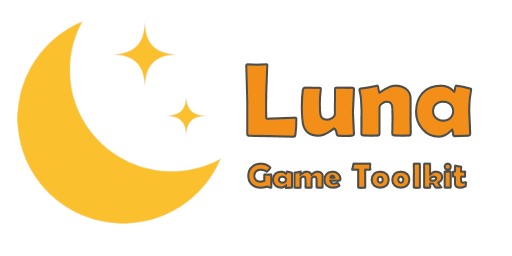

<a href="https://topazgamelibrary.com" target="_blank"></a>

[](https://discord.gg/tPWjMwK) [](https://github.com/tinyBigGAMES/Luna/stargazers) [](https://github.com/tinyBigGAMES/Luna/network/members) [](https://github.com/tinyBigGAMES/Luna/network/members)
[](https://twitter.com/tinyBigGAMES)

## Overview
Luna Game Toolkit&trade; is an open-source 2D indie game library that allows you to do game development in <a href="https://www.embarcadero.com/products/delphi" target="_blank"> Embarcadero Delphi</a> for desktop PC's running Microsoft Windows® and uses Direct3D® for hardware accelerated rendering.

It's robust, designed for easy use and suitable for making all types of 2D games and other graphic simulations, You access the features from a simple and intuitive API, to allow you to rapidly and efficiently develop your projects. There is support for bitmaps, audio samples, streaming music, video playback, loading resources directly from a compressed and encrypted archive, a thin object oriented actor/scene system, entity state machine, sprite management, collision detection and much more. Luna Game Toolkit, easy, fast & fun!

Please star this repo by clicking the Star box in the top right corner if you find it useful!

if you wish to learn more about the Delphi language visit <a href="https://learndelphi.org/" target="_blank">learndelphi.org</a>.

## Downloads
<a href="https://github.com/tinyBigGAMES/Luna/archive/refs/heads/main.zip" target="_blank">**Development**</a> - This build represents the most recent development state an as such may or may not be as stable as the official release versions. If you like living on the bleeding edge, it's updated frequently (often daily) and will contain bug fixes and new features.

<a href="https://github.com/tinyBigGAMES/Luna/releases" target="_blank">**Releases**</a> - These are the official release versions and deemed to be the most stable.

## Features
- **Free** and open-source. See <a href="https://github.com/tinyBigGAMES/Luna/blob/main/LICENSE" target="_blank">License agreement</a>.
- Written in **Object Pascal**
- Support Windows 64 bit platform
- Powered by SDL (https://github.com/libsdl-org/SDL)
- Everything will be linked into your executable, ready for use with no DLLs to maintain. 
- Hardware accelerated with **Direct3D**
- You interact with Luna via your derived `TLuGame` class and the various classes and routines in the `Luna` unit.
- **Archive** (zip archive format, password protection)
- **Window** (Direct3D, anti-aliasing, vsync, viewports, primitives, blending)
- **Input** (keyboard, mouse and joystick)
- **Texture** (color key transparency, scaling, rotation, flipped, titled,  BMP, DDS, PCX, TGA, JPEG, PNG)
- **Video** (play, pause, rewind, OGV format)
- **Sprite** (pages, groups, animation, poly-point collision)
- **Entity** (defined from a sprite, position, scale, rotation, collision)
- **Audio** (samples, streams, WAV, OGG/Vorbis, FLAC formats)
- **Font** (true type, scale, rotate)
- **Timing** (time-based, frame elapsed, frame speed)
- **Social** (post to all your social accounts, text and media, powered by <a href="https://dlvrit.com/" target="_blank">dlvrit.com</a>)
- **Misc** (collision, easing, screen shake, screenshot, starfield, colors, INI based config files, startup dialog, treeview menu)
- And more. See `Luna.pas` in `installdir\sources` and the docs in `installdir\docs` for more information about features.

## Minimum System Requirements
- <a href="https://www.embarcadero.com/products/delphi/starter" target="_blank">Delphi Community Edition</a>, win64 platform
- Microsoft Windows 10, 64 bits
- DirectX 9

## Sponsor Benefits 
- You will have priority support with access to our private Luna development forum and discord channel.
- You will have access to private betas, documents, etc. and be able to help shape the direction of the product.
- You will be helping us continue developing this product, thank you in advance.
- I want to <a href="https://github.com/sponsors/tinyBigGAMES/" target="_blank">sponsor</a> this project.

## Other ways to help
- I will make some examples and demos using this project.
- I will spread the word about this project.
- I wish to do X for this project.

Thank you very much for any support you can provide, I will be most grateful. :clap: 

## How to use in Delphi
- Unzip the archive to a desired location.
- Add `installdir\sources`, folder to Delphi's library path so the library source files can be found for any project or for a specific project add to its search path.
- Use `LuArc` utility for making archive files (compressed, encrypted custom format). Running the `makearc.bat` in `installdir\bin` will build `Data.arc` that is used by the examples.
- In Delphi, load `Luna Game Toolkit.groupproj` to load and compile the examples, which will showcase the library features and how to use them.
- See examples in the `installdir\examples` for more information about usage.

***NOTE: All executables in this repo that are created by us will be digitally signed as tinyBigGAMES LLC, for your protection and peace of mind.***

## Known Issues
- This project is in active development so changes will be frequent 
- Documentation is WIP. They will continue to evolve
- More examples will continually be added over time

## A Tour of Luna Game Toolkit
### Game Object
You just have to derive a new class from the `TLuGame` base class and override a few callback methods. You access the toolkit functionality from the `Luna` unit.
```pascal
uses
  Luna;

type
  { TMyGame }
  TMyGame = class(TLuGame)
  public
    procedure OnGetSettings(var aSettings: TGameSettings); override;
    procedure OnStartup; override;
    procedure OnShutdown; override;
    procedure OnUpdate(aDeltaTime: Double); override;
    procedure OnRender; override;
    procedure OnRendeHUD; override;
  end;
```
### How to use
A minimal implementation example:
```pascal

{ TMyGame }
procedure TMyGame.OnGetSettings(var aSettings: TGameSettings);
begin
  inherited;
  
  // add your settings code  
  aSettings.WindowWidth := 960;
  aSettings.WindowHeight := 540;
  aSettings.WindowTitle := 'My Game';
  aSettings.WindowClearColor := DARKSLATEBROWN;  
end;

procedure TMyGame.OnStartup;
begin
  inherited;
  
  // add your own startup code
end;

procedure TMyGame.OnShutdown;
begin
  // add your shutdown code
  
  inherited;
end;

procedure TMyGame.OnUpdate(aDeltaTime: Double);
begin
  inherited;
  
  // add your update code
end;

procedure TMyGame.OnRender;
begin
  inherited;
  
  // render your render code
end;

procedure TMyGame.OnRenderHUD;
begin
  inherited;
  
  // add your render HUD code 
end;
```
To run your game, call
```pascal
LuRunGame(TMyGame);
```
**NOTE:** For a LGT game to work properly, execution MUST start with `LuRunGame(...)`. Only a single instance will be allowed to run, all other instances will quietly terminate.

See the examples for more information on usage.

## Media

Luna Game Toolkit Intro


## Support
Our development motto: 
- We will not release products that are buggy, incomplete, adding new features over not fixing underlying issues.
- We will strive to fix issues found with our products in a timely manner.
- We will maintain an attitude of quality over quantity for our products.
- We will establish a great rapport with users/customers, with communication, transparency and respect, always encouraging feedback to help shape the direction of our products.
- We will be decent, fair, remain humble and committed to the craft.

### Links:
- <a href="https://github.com/tinyBigGAMES/Luna/discussions" target="_blank">Discussions</a>
- <a href="https://github.com/tinyBigGAMES/Luna/issues" target="_blank">Issue Tracking</a>
- <a href="https://discord.gg/tPWjMwK" target="_blank">Discord</a> (#luna-game-toolkit)
- <a href="https://twitter.com/tinyBigGAMES" target="_blank">Twitter</a>
- <a href="https://youtube.com/tinyBigGAMES" target="_blank">YouTube</a>
- <a href="https://tinybiggames.com" target="_blank">Homepage</a>

<p align="center">
 <a href="https://www.embarcadero.com/products/delphi" target="_blank"></a><br/>
 ♥ <b>Made for Delphi</b>
</p>
